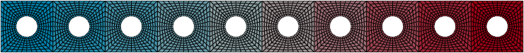
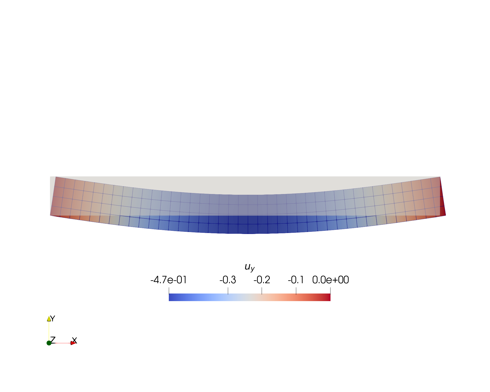

# Getting started
In this example a heterogeneous beam structure is optimized.
The design variables are the Young's Moduli $E_q$, $q=1, \ldots, N$ for the $N$ subdomains.
Each subdomain corresponds to a unit cell (square with a hole).
The objective function $J$ is the compliance plus some cost functional

$$
\begin{equation}
J(\boldsymbol{u}_{\mu}, \mu) = \boldsymbol{f}_{\mathrm{ext}}^T \boldsymbol{u}_{\mu} + \sum_{i=1}^N w_i(\mu_i- \mathrm{min}(\mu_i))^2\,.
\end{equation}
$$

The second term is the cost functional with weights $w_1, \ldots, w_N$.
Currently, $w_i=1$ is chosen.
The range of each parameter component $\mu_i$ is currently set to $[0.1, 10]$.

## Setup

## Full fine scale mesh

## Displacement solution
Exemplary displacement solution. Outdated.

## Parametrization and weak form
Assume different Young's Modulus for each unit cell of the lattice structure, i.e. $\mu=(\mu_1,\ldots,\mu_N)=(E_1,\ldots,E_N)$ where $N$ is the number of cells in the lattice structure. Each unit cell is denoted by $\varOmega_i$, $i=1, \ldots, N$.
Assuming $\nu=\mathrm{const.}$, we can find a form such that $\theta_q(\mu)=E_q$ (leading to $Q_a=N$).

$$
\begin{align}
a(w, v;\mu) &= \sum_{q=1}^{N} \int_{\varOmega_q} L(\mu) \varepsilon_{kk}^2 + 2M(\mu) \varepsilon_{ij}\varepsilon_{ij}\,\mathrm{d}x\\
            &= \sum_{q=1}^{N} E_q \frac{1}{(1+\nu)} \int_{\varOmega_q} \frac{\nu}{(1-2\nu)} \varepsilon_{kk}^2 + \varepsilon_{ij}\varepsilon_{ij}\,\mathrm{d}x\,.
\end{align}
$$

$$
\begin{equation}
\theta_q(\mu) = E_q\,,\quad a_q(w, v)= \frac{1}{(1+\nu)} \int_{\varOmega_q} \frac{\nu}{(1-2\nu)} \varepsilon_{kk}^2 + \varepsilon_{ij}\varepsilon_{ij}\,\mathrm{d}x
\end{equation}
$$
